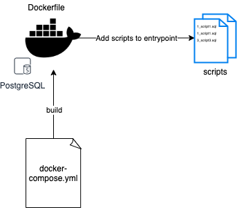

# Postgres - Automated container with seed data file

This project is a very simple example of how you can execute an image of Postgres with an initial set of data.

## How



## Steps

This project can be divided into three different moments.
* **Dockerfile** - Containing the image construction where we feed the entry point with sql scripts.
* **Script execution** - This scripts will execute when the container is started.
* **Docker compose file** - File used to define services to execute (in this case we'll only have a Postgres service from the previous Dockerfile)

## Usage

Run the following command to start the service

```docker
docker-compose up --build -d
```

Now you can use any database admin tool to see the data created on the database.

Configurations:
* Host:Port = localhost:15432
* Database_name = mydb
* User/password = admin/admin

## Contributing
Pull requests are welcome. For major changes, please open an issue first to discuss what you would like to change.
